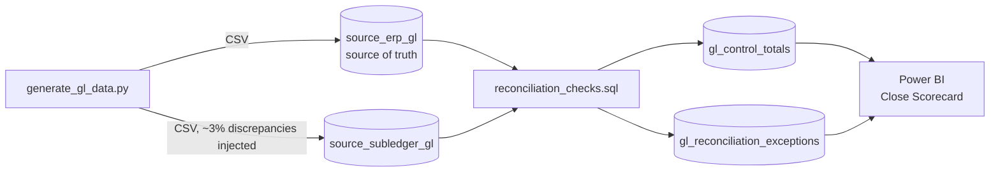

# GL/P&L Reconciliation Dashboard

[](https://github.com/KushPatel29/gl-reconciliation-dashboard-/actions/workflows/ci.yml)

A finance-grade reconciliation pipeline and Power BI scorecard that catches
the four discrepancy types that break month-end close: timing differences,
missing postings, amount mismatches, and duplicate entries — comparing an
ERP general ledger against a subledger/AP feed. Runs end-to-end locally in
seconds with zero database setup, and CI re-verifies the detection logic on
every push.

Synthetic data (no real company financials), but the reconciliation logic and
dashboard structure mirror the GL/P&L reconciliation work referenced on my
resume.

## Why this project

"We reconciled GL to subledger" is a common resume line that's hard to prove
without a concrete artifact. This project makes the reconciliation logic
runnable and the results visual: given two sources that are supposed to tie
out but don't, produce (1) control totals by account/period, (2) a
categorized exception list, and (3) a close-scorecard dashboard a controller
would actually use.

## Architecture



## Repo layout

```
data_generator/     synthetic ERP + subledger GL generator (Python)
data/               generated CSVs (dim_account, dim_cost_center, two GL sources)
sql/                reconciliation_checks.sql — T-SQL reference for SQL Server/Fabric
engine/             SQLite-backed runner: the same SQL, executable with no DB setup
tests/              pytest suite proving each discrepancy class is detected
output/             engine results — control totals, exception log, summary
.github/workflows/  CI — regenerates data, runs the engine, runs the tests
```

## The four discrepancy types detected

| Type | Cause simulated | Detection logic |
|---|---|---|
| Missing in subledger | ~0.5% of transactions never made it to the feed | LEFT JOIN, ERP row with no subledger match |
| Timing difference | ~1% posted in the following period | Same transaction id, different period |
| Amount mismatch | ~1% data-entry/rounding error | Same transaction id + period, amount differs > $0.01 |
| Duplicate posting | ~1% posted twice in the subledger | GROUP BY transaction id + period, count > 1 |

## How to reproduce (60 seconds, no database needed)

```bash
pip install -r data_generator/requirements.txt
python data_generator/generate_gl_data.py     # create the two GL sources
python engine/run_reconciliation.py           # run the reconciliation
```

The engine loads the CSVs into an in-memory SQLite database and executes the
reconciliation in SQL (a direct translation of the T-SQL reference in
`sql/reconciliation_checks.sql`), writing control totals, the categorized
exception log, and a summary to `output/`. Point Power BI at those CSVs
following [`powerbi/BUILD_GUIDE.md`](powerbi/BUILD_GUIDE.md), or run the
T-SQL version directly against SQL Server / Fabric Warehouse.

Verify the detection logic:

```bash
pip install pytest
pytest tests/ -v    # 6 tests — every discrepancy class found, every dollar accounted for
```

## Beyond GL: the same pattern for any two-systems-that-must-agree problem

GL-to-subledger is one instance of a universal problem: two systems that
are supposed to hold the same facts, and don't. The engine's four checks
(missing / timing / value mismatch / duplicate) apply unchanged to:

| Industry | System A | System B |
|---|---|---|
| Banking / fintech | Core banking ledger | Payment processor settlement file |
| Insurance | Policy admin system | Claims/billing system |
| Healthcare | EHR charges | Billing clearinghouse |
| E-commerce | Order management | Payment gateway + refunds |
| SaaS | CRM (bookings) | Billing system (invoices) |
| Any M&A / migration | Legacy system | New system during parallel run |

## Notes on the synthetic data

All data is generated by `data_generator/generate_gl_data.py` using Faker and
numpy. No real financial data is used anywhere in this repo.
