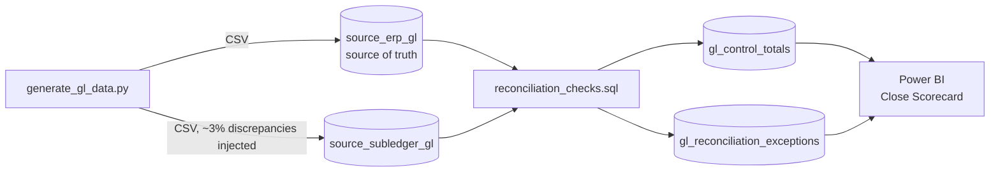

# GL/P&L Reconciliation Dashboard

[](https://github.com/KushPatel29/gl-reconciliation-dashboard-/actions/workflows/ci.yml)


A finance-grade reconciliation pipeline and Power BI scorecard that catches
the four discrepancy types that break month-end close: timing differences,
missing postings, amount mismatches, and duplicate entries — comparing an
ERP general ledger against a subledger/AP feed. Runs end-to-end locally in
seconds with zero database setup, and CI re-verifies the detection logic on
every push.

Synthetic data (no real company financials), but the reconciliation logic and
dashboard structure mirror the GL/P&L reconciliation work referenced on my
resume.

## Dashboard

Three-page Power BI close scorecard, hand-authored as a Power BI Project
(TMDL semantic model + PBIR report definition) in
[`powerbi/pbip/`](powerbi/pbip/) — open `GLReconciliationDashboard.pbip` in
Power BI Desktop and hit Refresh.

**Close Scorecard** — the month-end health check: match rate, exception count
and dollar impact, accounts out of tolerance:


**Variance by Account** — ERP vs subledger control totals with net variance:


**Exception Detail** — the row-level triage list, split by discrepancy type:


**Close Insights** — advanced analytics: match-rate gauge vs the 98% SLA,
variance waterfall by account, exception mix and impact trend:


## Why this project

"We reconciled GL to subledger" is a common resume line that's hard to prove
without a concrete artifact. This project makes the reconciliation logic
runnable and the results visual: given two sources that are supposed to tie
out but don't, produce (1) control totals by account/period, (2) a
categorized exception list, and (3) a close-scorecard dashboard a controller
would actually use.

## Architecture



## Repo layout

```
data_generator/     synthetic ERP + subledger GL generator (Python)
data/               generated CSVs (dim_account, dim_cost_center, two GL sources)
sql/                reconciliation_checks.sql — T-SQL reference for SQL Server/Fabric
finops/             FinOps mode — FOCUS billing generator, mapping, coverage KPI
engine/             SQLite-backed runner: the same SQL, executable with no DB setup
powerbi/            DAX measure library, build guide, and the ready-to-open
                     PBIP project (TMDL model + PBIR report, 5 pages)
tests/              pytest suite proving each discrepancy class is detected (GL + FinOps)
output/             engine results — control totals, exception log, summary
.github/workflows/  CI — regenerates data, runs the engine, runs the tests
```

## The four discrepancy types detected

| Type | Cause simulated | Detection logic |
|---|---|---|
| Missing in subledger | ~0.5% of transactions never made it to the feed | LEFT JOIN, ERP row with no subledger match |
| Timing difference | ~1% posted in the following period | Same transaction id, different period |
| Amount mismatch | ~1% data-entry/rounding error | Same transaction id + period, amount differs > $0.01 |
| Duplicate posting | ~1% posted twice in the subledger | GROUP BY transaction id + period, count > 1 |

## Framed as an internal control (SOX-style)

Reconciliation isn't just analytics — in a public company it's a key
control. Here's this project expressed the way an internal-audit PBC list
would describe it:

| | |
|---|---|
| **Control ID** | GL-REC-01 — GL-to-subledger reconciliation |
| **Objective** | Completeness & accuracy of the GL: every subledger dollar ties to the GL within materiality |
| **Frequency** | Monthly, at close (CI re-executes it on every code change) |
| **Owner** | Assistant Controller (simulated) |
| **Threshold** | 0.5% of account balance (`Is Out of Tolerance` measure) |
| **Evidence** | `output/gl_control_totals.csv`, categorized exception log, close-scorecard snapshot |
| **Escalation** | Exceptions grouped by root cause and routed by type — duplicates to AP, timing to accruals review |

The pytest suite doubles as control testing: it proves the reconciliation
detects each discrepancy class it claims to detect — which is exactly what
an auditor's re-performance test does.

## The same engine, pointed at a cloud bill (FinOps)

Reconciliation engines shouldn't care what the two systems are. To prove
this one is a platform rather than a single-purpose script, [`finops/`](finops/)
maps a **FOCUS-shaped cloud billing export** (the FinOps Foundation's open
billing spec) and its internal chargeback ledger onto the same two staging
schemas, plants one of each cloud anomaly, and runs the engine **unmodified**
— a test asserts the engine source contains no cloud-specific branches:

| Engine classification | Cloud billing cause |
|---|---|
| Missing in subledger | **Untagged spend** — no department tag, so the charge never reaches chargeback |
| Timing difference | **Upfront Savings Plan** — billed as a May cash spike, accrued by finance in June |
| Amount mismatch | **Unapplied EDP discount** — billed at list price, allocated at the contracted rate |
| Duplicate posting | **Marketplace double-billing** — SaaS charged via marketplace *and* a direct invoice |

All four are recovered with zero false positives on the clean charges
(`python finops/focus_demo.py`; column-by-column mapping guide in
[`finops/README.md`](finops/README.md)).

Beyond the didactic demo, FinOps mode runs at dataset scale:
[`generate_focus_data.py`](finops/generate_focus_data.py) produces six
months of billing (~410 charge lines, ~$700K) with anomalies injected at
realistic rates — every one recorded in an **anomaly manifest**, and the
test suite asserts the engine recovers *exactly* that set: nothing missed,
nothing invented. [`run_finops_recon.py`](finops/run_finops_recon.py) adds
the KPI reconciliation alone can't give you, **allocation coverage** — the
share of each month's billed spend that reached a cost-center owner (99.0%
here; untagged resources are exactly the gap). The results land on their
own dashboard page:

**Cloud Chargeback (FinOps)** — billed spend, allocation coverage, untagged
dollars, exception mix, and the FINOPS-REC-01 evidence list:


As a control, the cloud variant is:

| | |
|---|---|
| **Control ID** | FINOPS-REC-01 — cloud invoice to cost-center ledger reconciliation |
| **Objective** | Completeness & accuracy of chargebacks: every billed dollar is allocated to an owner |
| **Threshold** | 0.5% of monthly cloud spend for variance investigation |
| **Escalation** | Untagged spend → platform engineering (fix the tags); rate mismatches → vendor management; duplicates → AP |

## How to reproduce (60 seconds, no database needed)

```bash
pip install -r data_generator/requirements.txt
python data_generator/generate_gl_data.py     # create the two GL sources
python engine/run_reconciliation.py           # run the reconciliation
```

The engine loads the CSVs into an in-memory SQLite database and executes the
reconciliation in SQL (a direct translation of the T-SQL reference in
`sql/reconciliation_checks.sql`), writing control totals, the categorized
exception log, and a summary to `output/`. Then open the pre-built
dashboard — [`powerbi/pbip/GLReconciliationDashboard.pbip`](powerbi/pbip/)
(see [`powerbi/pbip/OPEN_ME_FIRST.md`](powerbi/pbip/OPEN_ME_FIRST.md)) — or
run the T-SQL version directly against SQL Server / Fabric Warehouse.

Verify the detection logic:

```bash
pip install pytest
pytest tests/ -v    # 22 tests — every discrepancy class found, every dollar accounted for,
                    # in GL mode and FinOps mode, plus Power BI model/report integrity
```

## Tableau version

The close scorecard is also buildable in Tableau in ~15 minutes:
[`tableau/prepare_tableau_data.py`](tableau/prepare_tableau_data.py) produces
flat, analysis-ready extracts (variance with a precomputed materiality flag,
exceptions with impact amounts) and
[`tableau/BUILD_TABLEAU.md`](tableau/BUILD_TABLEAU.md) is the click-by-click
build + Tableau Public publish guide, themed to match the rest of the
portfolio.

## Beyond GL: the same pattern for any two-systems-that-must-agree problem

GL-to-subledger is one instance of a universal problem: two systems that
are supposed to hold the same facts, and don't. The engine's four checks
(missing / timing / value mismatch / duplicate) apply unchanged to:

| Industry | System A | System B |
|---|---|---|
| Banking / fintech | Core banking ledger | Payment processor settlement file |
| Insurance | Policy admin system | Claims/billing system |
| Healthcare | EHR charges | Billing clearinghouse |
| E-commerce | Order management | Payment gateway + refunds |
| SaaS | CRM (bookings) | Billing system (invoices) |
| Any M&A / migration | Legacy system | New system during parallel run |

## Notes on the synthetic data

All data is generated by `data_generator/generate_gl_data.py` using Faker and
numpy. No real financial data is used anywhere in this repo.
