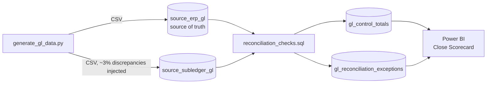

# GL/P&L Reconciliation Dashboard

A finance-grade reconciliation pipeline and Power BI scorecard that catches
the four discrepancy types that break month-end close: timing differences,
missing postings, amount mismatches, and duplicate entries — comparing an
ERP general ledger against a subledger/AP feed.

Synthetic data (no real company financials), but the reconciliation logic and
dashboard structure mirror the GL/P&L reconciliation work referenced on my
resume.

## Why this project

"We reconciled GL to subledger" is a common resume line that's hard to prove
without a concrete artifact. This project makes the reconciliation logic
runnable and the results visual: given two sources that are supposed to tie
out but don't, produce (1) control totals by account/period, (2) a
categorized exception list, and (3) a close-scorecard dashboard a controller
would actually use.

## Architecture



## Repo layout

```
data_generator/   synthetic ERP + subledger GL generator (Python)
data/             generated CSVs (dim_account, dim_cost_center, two GL sources)
sql/              reconciliation_checks.sql — control totals + 4 exception types
powerbi/          DAX measures + Power BI build guide
```

## The four discrepancy types detected

| Type | Cause simulated | Detection logic |
|---|---|---|
| Missing in subledger | ~0.5% of transactions never made it to the feed | LEFT JOIN, ERP row with no subledger match |
| Timing difference | ~1% posted in the following period | Same transaction id, different period |
| Amount mismatch | ~1% data-entry/rounding error | Same transaction id + period, amount differs > $0.01 |
| Duplicate posting | ~1% posted twice in the subledger | GROUP BY transaction id + period, count > 1 |

## How to reproduce

```bash
cd data_generator
pip install -r requirements.txt
python generate_gl_data.py
```

Load the resulting CSVs into staging tables (`stg_erp_gl`, `stg_subledger_gl`)
in SQL Server / Fabric Warehouse / SQLite, run `sql/reconciliation_checks.sql`,
then follow [`powerbi/BUILD_GUIDE.md`](powerbi/BUILD_GUIDE.md) to build the
dashboard.

## Notes on the synthetic data

All data is generated by `data_generator/generate_gl_data.py` using Faker and
numpy. No real financial data is used anywhere in this repo.
