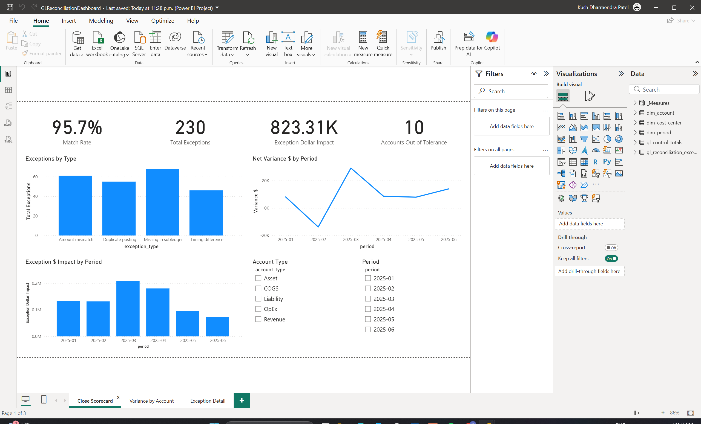
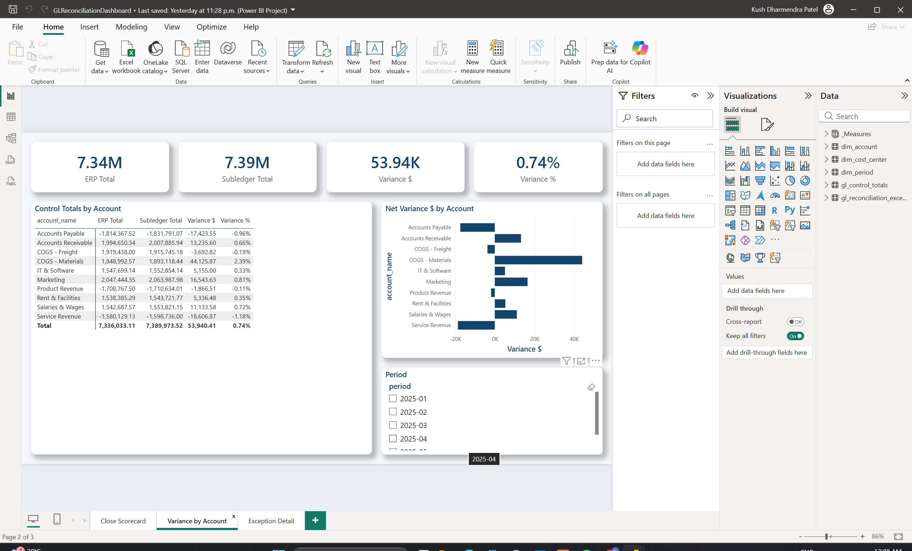
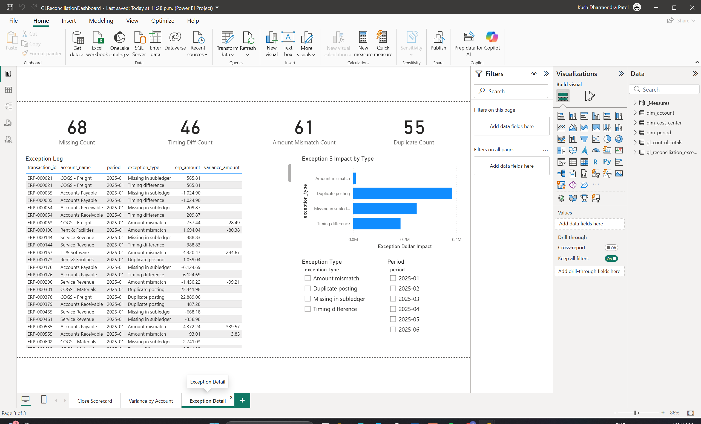
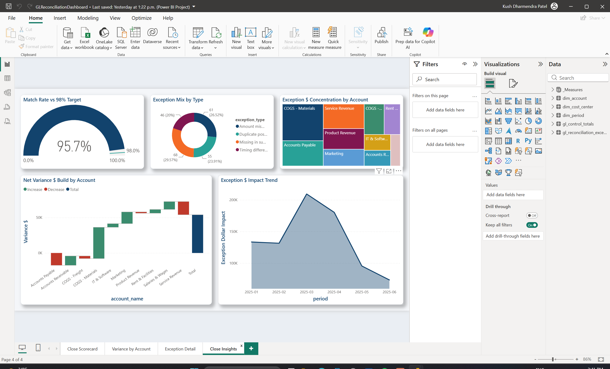
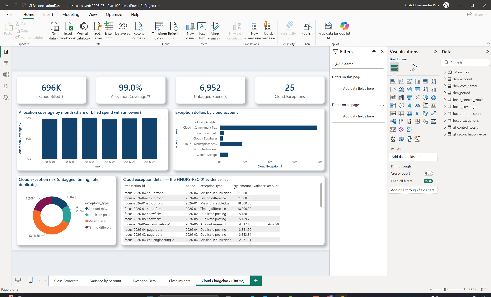
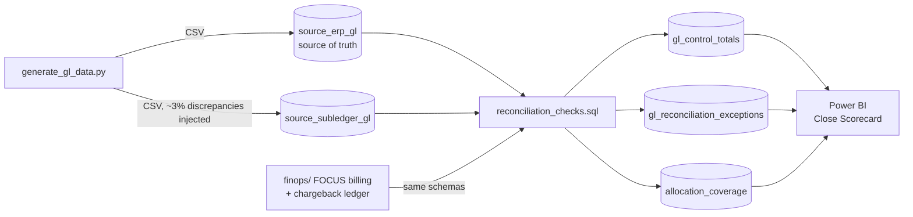

# GL/P&L Reconciliation Dashboard

[](https://github.com/KushPatel29/gl-reconciliation-dashboard-/actions/workflows/ci.yml)


Every BI resume says "reconciled GL to subledger." Almost nobody can show
you, because the real work happened inside a company's ERP and left with
the badge. Mine did too — the reconciliation work I did at a food
distributor is described on my resume and locked in their systems.

So this repo is the version you can open. Two ledgers that are supposed to
agree and don't; SQL that finds every disagreement and names it; a
month-end scorecard a controller would actually stare at; and a test suite
that re-proves the whole thing on every push. The data is synthetic (no
real financials anywhere), but the logic is the job.

And because a reconciliation engine shouldn't care what the two systems
are, the second act points the exact same code at a **cloud bill** — more
on that below.

## What actually breaks a month-end close

When the GL says one thing and the AP feed says another, the gap is never
one problem — it's four different problems wearing the same trench coat,
and each needs a different fix and a different owner:

| Type | What happened | How the SQL catches it |
|---|---|---|
| Missing in subledger | The transaction never made it to the feed | LEFT JOIN, ERP row with no subledger match |
| Timing difference | Posted, but in the following period | Same transaction id, different period |
| Amount mismatch | Data-entry or rounding error | Same id + period, amount differs > $0.01 |
| Duplicate posting | Keyed in twice | GROUP BY id + period, count > 1 |

On the generated dataset (~3% of postings deliberately corrupted), the
engine surfaces **230 exceptions**: 68 missing, 61 amount mismatches, 55
duplicates, 46 timing differences. Duplicates are only a quarter of the
count but carry most of the dollars — $145K of the impact — which is
exactly the kind of thing a count-only report hides and a controller needs
to know first.

The detection lives in [`sql/reconciliation_checks.sql`](sql/reconciliation_checks.sql),
written as T-SQL for SQL Server / Fabric Warehouse. The local engine
([`engine/run_reconciliation.py`](engine/run_reconciliation.py)) executes a
direct SQLite translation of it in memory, so the whole thing runs on a
fresh clone in seconds with no database to install — what you read in
`sql/` is what runs.

## The dashboard

Five Power BI pages, hand-authored as code (TMDL semantic model + PBIR
report definition) in [`powerbi/pbip/`](powerbi/pbip/) — open
`GLReconciliationDashboard.pbip` in Power BI Desktop and hit Refresh.

**Close Scorecard** — the page a controller opens first: match rate,
exception count and dollar impact, accounts out of tolerance:



**Variance by Account** — ERP vs subledger control totals with net variance:



**Exception Detail** — the row-level triage list, split by discrepancy type:



**Close Insights** — match-rate gauge vs the 98% SLA, variance waterfall by
account, exception mix and impact trend:



## Reconciliation is a control, not a report

In a public company this isn't analytics, it's a key control with an ID on
an audit PBC list. So here's the project written the way internal audit
would write it:

| | |
|---|---|
| **Control ID** | GL-REC-01 — GL-to-subledger reconciliation |
| **Objective** | Completeness & accuracy of the GL: every subledger dollar ties to the GL within materiality |
| **Frequency** | Monthly, at close (CI re-executes it on every code change) |
| **Owner** | Assistant Controller (simulated) |
| **Threshold** | 0.5% of account balance (`Is Out of Tolerance` measure) |
| **Evidence** | `output/gl_control_totals.csv`, categorized exception log, close-scorecard snapshot |
| **Escalation** | Exceptions routed by root cause — duplicates to AP, timing to accruals review |

The pytest suite doubles as control testing. An auditor doesn't take your
word that a control works — they re-perform it. That's literally what the
tests do: corrupt the data in a known way, run the control, confirm it
catches exactly what it claims to catch.

## Act two: I pointed the same engine at a cloud bill

Somewhere while building this I realized the hardest problem in mature
FinOps — tying the cloud provider's invoice to the internal cost-center
chargebacks — isn't *like* GL reconciliation. It *is* GL reconciliation.
The same four failure modes show up wearing cloud costumes:

| Engine classification | Cloud billing cause |
|---|---|
| Missing in subledger | **Untagged spend** — no department tag, so the charge never reaches chargeback |
| Timing difference | **Upfront Savings Plan** — billed as a May cash spike, accrued by finance in June |
| Amount mismatch | **Unapplied EDP discount** — billed at list price, allocated at the contracted rate |
| Duplicate posting | **Marketplace double-billing** — SaaS charged via marketplace *and* a direct invoice |

Claiming the analogy is easy; [`finops/`](finops/) proves it by execution.
A billing export shaped like the FinOps Foundation's **FOCUS** spec and its
chargeback ledger get mapped onto the same two staging schemas
(column-by-column guide in [`finops/README.md`](finops/README.md)), and the
engine runs **unmodified** — one test greps the engine source to make sure
no cloud-specific branch ever sneaks in.

It runs at two scales. [`focus_demo.py`](finops/focus_demo.py) plants
exactly one of each anomaly and shows the engine classifying all four.
Then [`generate_focus_data.py`](finops/generate_focus_data.py) does it at
dataset scale: six months, ~410 charge lines, ~$700K billed, anomalies
injected at realistic rates — and every injection is recorded in an
**anomaly manifest**, so the tests can demand the engine recover *exactly*
that set. Nothing missed, nothing invented. A synthetic benchmark without
a manifest is decoration; the manifest is what makes it falsifiable.

The scaled run also computes the one KPI reconciliation alone can't give
you: **allocation coverage**, the share of each month's billed spend that
reached a cost-center owner. Here it's 99.0%, and the gap is precisely the
untagged resources. All of it lands on its own dashboard page:



And because the GL side gets a control ID, the cloud side gets one too:

| | |
|---|---|
| **Control ID** | FINOPS-REC-01 — cloud invoice to cost-center ledger reconciliation |
| **Objective** | Completeness & accuracy of chargebacks: every billed dollar is allocated to an owner |
| **Threshold** | 0.5% of monthly cloud spend for variance investigation |
| **Escalation** | Untagged spend → platform engineering (fix the tags); rate mismatches → vendor management; duplicates → AP |

## The same pattern, anywhere two systems must agree

GL-to-subledger and invoice-to-chargeback are two instances of one
universal problem. The four checks apply unchanged to:

| Industry | System A | System B |
|---|---|---|
| Banking / fintech | Core banking ledger | Payment processor settlement file |
| Insurance | Policy admin system | Claims/billing system |
| Healthcare | EHR charges | Billing clearinghouse |
| E-commerce | Order management | Payment gateway + refunds |
| SaaS | CRM (bookings) | Billing system (invoices) |
| Any M&A / migration | Legacy system | New system during parallel run |

## Architecture



## Repo layout

```
data_generator/     synthetic ERP + subledger GL generator (Python)
data/               generated CSVs (dim_account, dim_cost_center, two GL sources)
sql/                reconciliation_checks.sql — T-SQL reference for SQL Server/Fabric
finops/             FinOps mode — FOCUS billing generator, mapping, coverage KPI
engine/             SQLite-backed runner: the same SQL, executable with no DB setup
powerbi/            DAX measure library, build guide, and the ready-to-open
                     PBIP project (TMDL model + PBIR report, 5 pages)
tests/              pytest suite proving each discrepancy class is detected (GL + FinOps)
output/             engine results — control totals, exception log, summary
.github/workflows/  CI — regenerates data, runs the engine, runs the tests
```

## Run it (60 seconds, no database needed)

```bash
pip install -r data_generator/requirements.txt
python data_generator/generate_gl_data.py     # create the two GL sources
python engine/run_reconciliation.py           # run the reconciliation
python finops/generate_focus_data.py          # FinOps mode: the cloud bill
python finops/run_finops_recon.py             # ...reconciled + coverage KPI
```

Then open the pre-built dashboard —
[`powerbi/pbip/GLReconciliationDashboard.pbip`](powerbi/pbip/) (see
[`powerbi/pbip/OPEN_ME_FIRST.md`](powerbi/pbip/OPEN_ME_FIRST.md)) — or run
the T-SQL directly against SQL Server / Fabric Warehouse.

Verify the claims:

```bash
pip install pytest
pytest tests/ -v    # 22 tests — every discrepancy class found, every dollar accounted for,
                    # in GL mode and FinOps mode, plus Power BI model/report integrity
```

## Tableau version

The close scorecard is also buildable in Tableau in ~15 minutes:
[`tableau/prepare_tableau_data.py`](tableau/prepare_tableau_data.py)
produces flat, analysis-ready extracts and
[`tableau/BUILD_TABLEAU.md`](tableau/BUILD_TABLEAU.md) is the click-by-click
build + publish guide, themed to match the rest of the portfolio.

## Notes on the synthetic data

Everything is generated by `data_generator/generate_gl_data.py` (Faker +
numpy, fixed seeds). No real financial data appears anywhere in this repo —
which is the point: the architecture is reproducible from nothing, and
every number above regenerates identically on every CI run.
